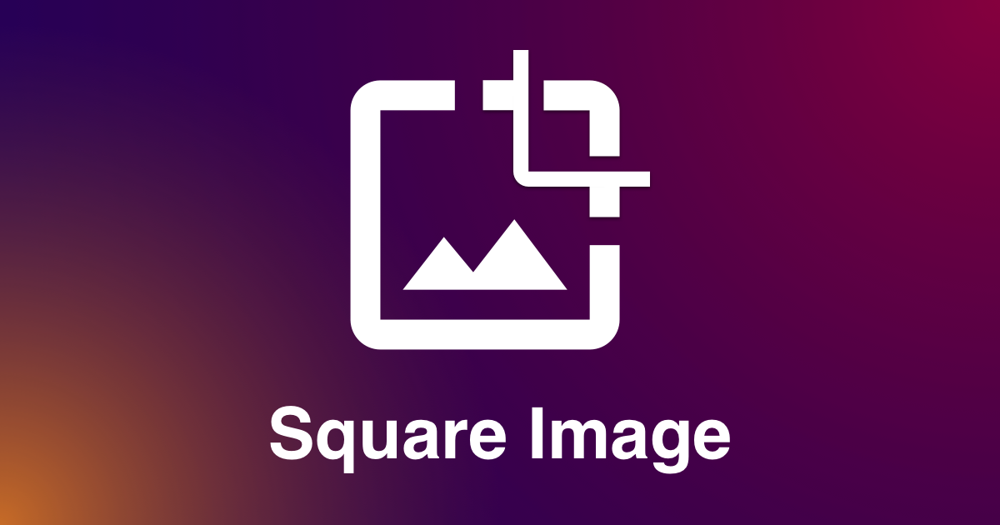

# Square Image

<p style="text-align: center;">
  <a href="https://7110.github.io/square-image/"></a>
</p>

> 🎨 securely shape the image square on the client side.

## Build Setup

``` bash
# install dependencies
$ yarn install

# serve with hot reload at localhost:3000
$ yarn dev

# build for production and launch server
$ yarn build
$ yarn start

# generate static project
$ yarn generate

# generate static project for gh-pages
$ yarn generate:gh-pages

# deploy /dist to gh-pages
$ yarn deploy
```
